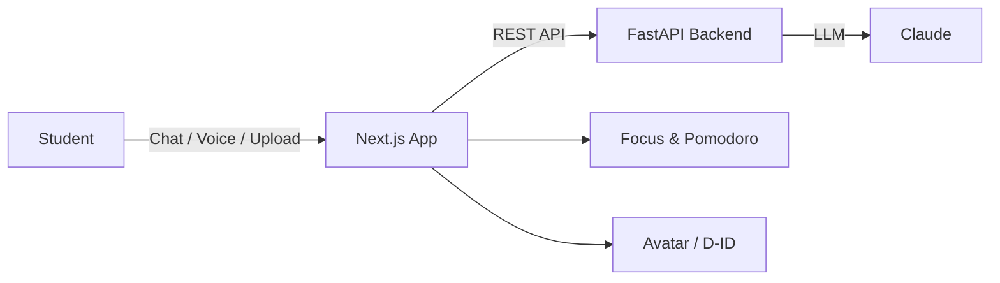
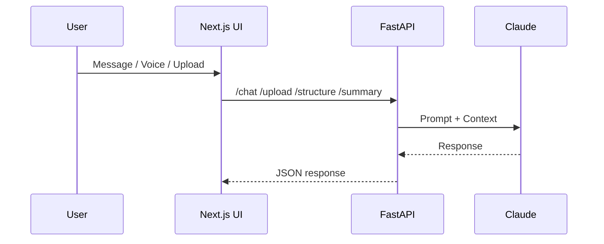

# Neuro-Peer

Neuro-Peer is an AI study buddy for Canadian university students (EN/FR). It blends peer‑style coaching, live tutoring, and quizzes driven by uploaded study material. It also includes attention‑aware feedback and a brain‑dump mode that turns rambling into structured notes.

**Visuals**




## Key Features
- Peer‑style AI tutoring with short, ADHD‑friendly responses
- Upload‑driven teaching: PDFs and text become the source of truth
- Brain‑dump mode: turns messy notes into organized study notes
- Pomodoro timer with session state and phase changes
- Optional D‑ID avatar for voice responses
- EN/FR language toggle (Canadian French)

## Tech Stack
- Next.js App Router
- React 18
- TypeScript
- Tailwind CSS
- FastAPI backend
- Claude (Anthropic API)
- Framer Motion
- Three.js + @react-three/fiber

## Local Setup
1. Install dependencies
```bash
npm install
```
2. Create `.env.local`
```bash
NEXT_PUBLIC_API_URL=http://localhost:8000
NEXT_PUBLIC_DID_AGENT_ID=your_did_agent_id
NEXT_PUBLIC_DID_API_KEY=your_did_api_key
```
3. Run the frontend
```bash
npm run dev
```
4. Run the backend (from `backend/`)
```bash
python -m venv venv
venv\Scripts\activate
pip install -r requirements.txt
uvicorn main:app --reload
```

## Project Structure
- `app/` Next.js routes
- `app/page.tsx` Landing page (Sign‑in flow)
- `app/session/page.tsx` Main study session UI
- `components/ui/` UI components (shadcn‑style path)
- `components/ui/sign-in-flow-1.tsx` Landing page component
- `components/ui/sign-in-flow-1-canvas.tsx` Canvas/Three.js shader logic
- `backend/` FastAPI app
- `backend/routes/` API endpoints
- `lib/` Frontend helpers (API, utils)

## API Endpoints (Backend)
- `POST /chat`
- `POST /upload`
- `POST /structure`
- `POST /summary`

## Screenshots
Add your own screenshots here:
- `docs/landing.png` Landing page
- `docs/session.png` Session UI

You can then reference them like:
```md


```

## Notes
- If you see a `ReactCurrentOwner` error, restart the dev server. The canvas shader is client‑only and loaded via `next/dynamic`.
- If `npm install` fails with `EACCES`, run your terminal as Administrator or fix npm cache permissions.

## Scripts
- `npm run dev` Start the frontend
- `npm run build` Build the frontend
- `npm run start` Start production server
- `npm run lint` Lint

## Roadmap Ideas
- Study history and analytics dashboard
- Focus detection and adaptive prompts
- Better quiz generation with item bank
- OCR for image uploads

---

If you want me to add real screenshots or a product walkthrough, tell me where you want the images stored.
